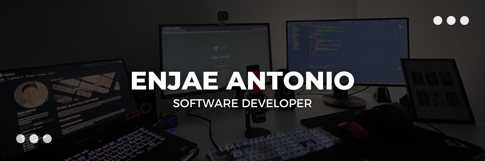

# Hi there 👋, my name is Enjae Antonio

I am 21 years old, I was born and raised in Winnipeg, Manitoba, and I'm currently on my journey to become a full-stack developer at MITT. As a Student Developer, I embrace the learning process and welcome any feedback on my projects to help me improve. Feel free to check them out and let me know your thoughts. Keep scrolling to explore more!

# Favourite Projects

## Code First Music System

This project is a full-stack Spotify-like application that was built using the code-first approach. The application allows users to search for and listen to music, and create playlists. I worked on implementing the database models, creating CRUD functionality for the database, and building the UI using ASP.NET MVC and Razor Pages.

##### Link: https://github.com/EnjaeAntonio/CodeFirstMusicSystem

## Mock Social Media Platform

This project is a front-end webpage that mimics a social media platform where users can create posts containing text or image content and displays the posts on the webpage. I worked on designing the user interface and implementing the functionality to allow users to create and delete posts.

##### Link: https://github.com/EnjaeAntonio/CodeFirstMusicSystem

## Current Skills ⌨️

## Other 🍎

-   🌱 I am currently an intern at My Little Tribe as a Full-Stack Software Developer!
-   📫 How to reach me: Enjaeantonio@outlook.com
-   ⬇️ My LinkedIn: https://www.linkedin.com/in/enjae-antonio-a6a8b2256/

